# A fast and correct triangle rasterizer

In this article series, you will get to learn how a computer draws a triangle on screen. This may sound like a silly thing to study, but if you go through the series you will likely discover that there are details, tradeoffs and complexity that you would not have thought about up front.

This is not unusual in the field of computer graphics - or even computer science: If you stumble upon a problem and ask yourself: "Can it be that hard" - then well, yes, sometimes it can! Drawing a triangle on screen correctly and efficiently is certainly not trivial. And at the same time, it is considered an "old" and "already solved" problem. However, that should not stop us from diving into the subject. Depending on your experience and skill level there are likely things to learn here, things that will be applicable in other fields related to programming - for example maths, numerics, computer graphics or performance optimization.

To begin with, let's have a look at what it means to draw a triangle on the screen. This process is often called triangle rasterization. The term can be explained like this: A triangle is defined by three points (vertices). By drawing lines between each of them the triangle appears.

However, on a computer screen we cannot draw lines directly, instead we need to draw pixels. Put differently: We need to change the colors for a given set of pixels on screen. They are organized in a regular grid, a _raster_, and this is what gives us the name: By rasterization we mean the process of figuring out how to draw a graphical object - defined by points or lines - on a pixel screen.

<p align="center">
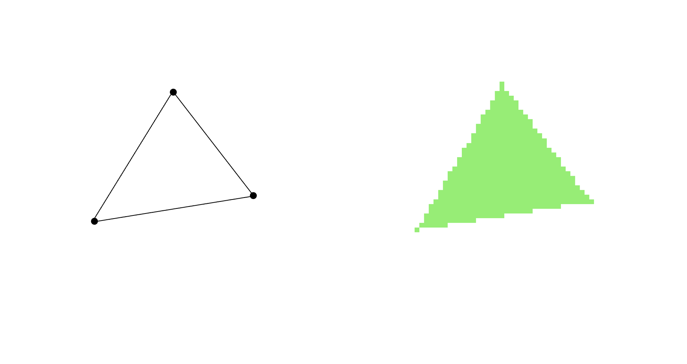
</p>

This tutorial is structured as follows: First, you will get to know the principles behind triangle rasterization and more details about the approach we will be using. Then we will write code that will become a simple, first version of a rasterizer. Then we will gradually refine it as we see needs for improvements. The final section in this tutorial looks at performance optimizations - and as you will see, the changes we make there will give the rasterizer a tenfold performance boost!

## Sections

1. [A walkthrough of the method](#1-a-walkthrough-of-the-method)
2. [Setting up the browser to draw pixels](#2-setting-up-the-browser-to-draw-pixels)
3. [The first, basic rasterizer](#3-the-first-basic-rasterizer)
4. [Moar triangles, moar problems](#4-moar-triangles-moar-problems)
5. [We've got to move it](#5-weve-got-to-move-it)
6. [Let's go continuous!](#6-lets-go-continuous)
7. [One solution, but two new problems](#7-one-solution-but-two-new-problems)
8. [Let's fix this](#8-lets-fix-this)
9. [Time to go incremental](#9-time-to-go-incremental)

If you want to test out, modify and run the example code locally, clone this repository, start a local web server in the root directory (for example, using `python3 -m http.server`) and open the web page (at `http://localhost:8000` or similar). Each subfolder in the directory list has a running application you can look at.

I you would prefer to just look at the example apps, follow the links at the end of each section.

# 1. A walkthrough of the method

(This article is part of a [series](#sections). You can jump to the [previous section](#readme) or the [next section](#2-setting-up-the-browser-to-draw-pixels) if you would like to.)

In this section, you will get to know the principles behind the rasterization method we will use.

## Introduction

The method was first published by Juan Piñeda in 1988, in a paper called ["A Parallel Algorithm for Polygon Rasterization"](https://www.cs.drexel.edu/~david/Classes/Papers/comp175-06-pineda.pdf). As the title says, it was made for parallel execution, something we will not have here, but since the algorithm actually is quite simple, and also well suited for serial execution, we will use it here.

If you search for triangle rasterization on the web, you will likely find many implementations of Piñeda's algorithm. The oldest one I have found is by Nicolas Capens, posted on the site `devmaster.net` (a game developer forum) back in 2004. His code seems to be the original one that has inspired most of the other triangle rasterizer implementations you will find. That web site does not exist anymore, but The Internet Archive [has a copy of the posting](https://web.archive.org/web/20120220025947/http://devmaster.net/forums/topic/1145-advanced-rasterization/) if you are interested.

## The inside test

Piñeda's method is based on scanning an region of candidate pixels, and for each candidate inside that region, finding out whether or not that pixel lies inside the triangle. If it is inside, the pixel is painted with the requested triangle color.

<p align="center">
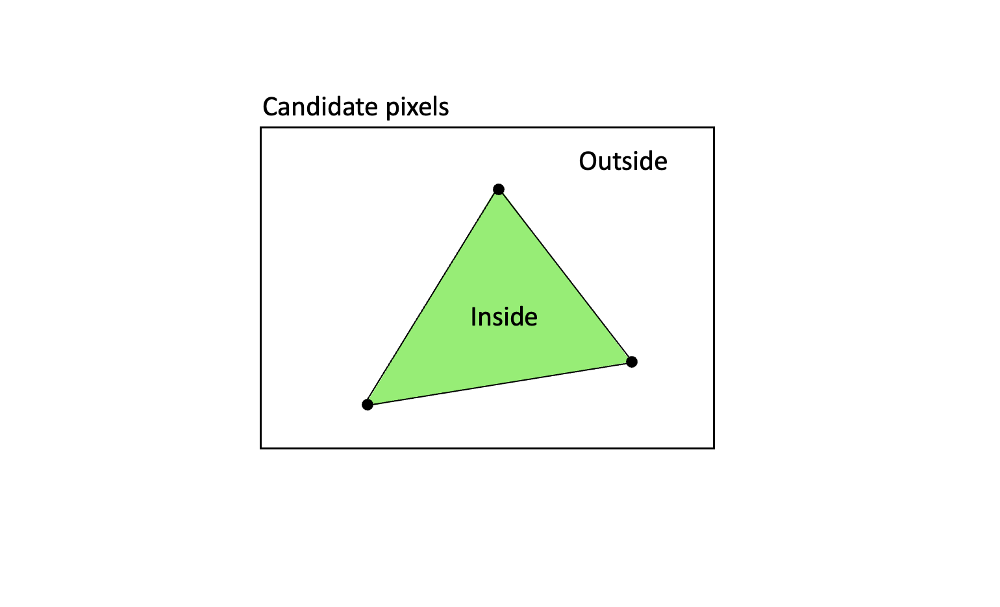
</p>

To do this efficiently, we have to set up our triangles in a specific way: We orient the vertices in a consistent order - which here is chosen to be counterclockwise. So, when going from any vertex and to the next, and then to the last one in the triangle, we will make a counterclockwise turn.

<p align="center">
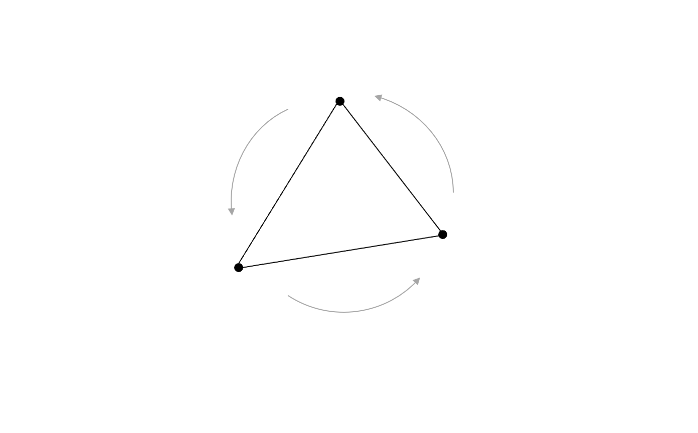
</p>

As long as all triangles to be drawn follow that convention, we can define a rule that will decide if a pixel is inside a triangle or not: "If a candidate pixel lies to the left of all three edges when we visit the vertices in order, then the pixel is inside the triangle."

<p align="center">
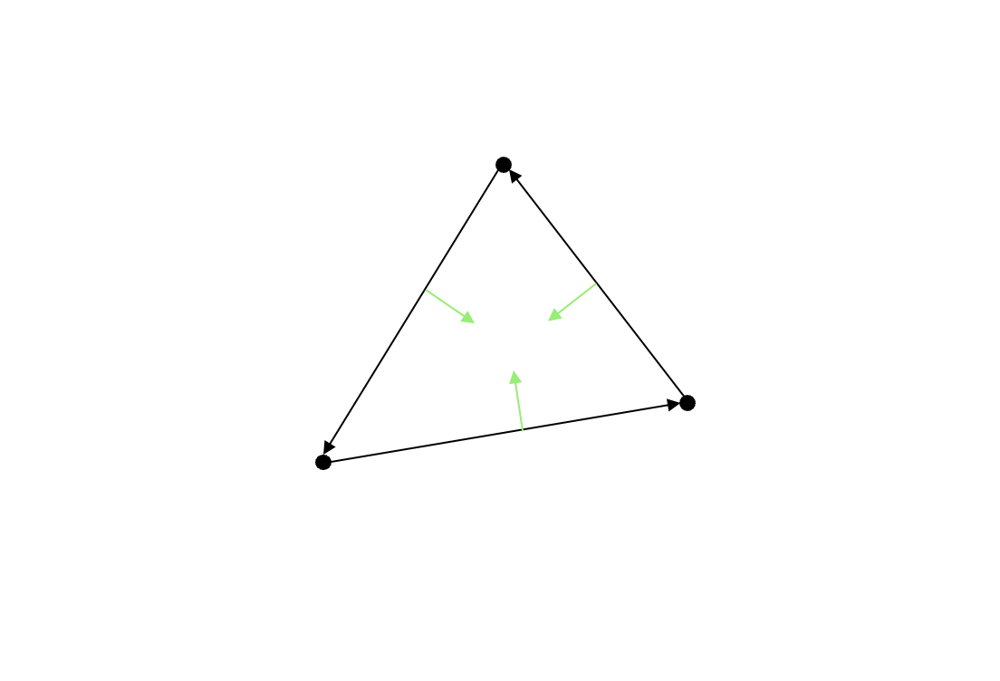
</p>

Finding out if a pixel lies to the left of an edge is not so hard. We can use a function that takes three coordinates as parameters - an edge start point, an edge end point, and a candidate pixel - and that returns a positive, zero or negative value. The result is positive if the candidate pixel is to the left of the edge, it will be zero if the pixel is exactly on the edge, and negative if the pixel is to the right.

<p align="center">
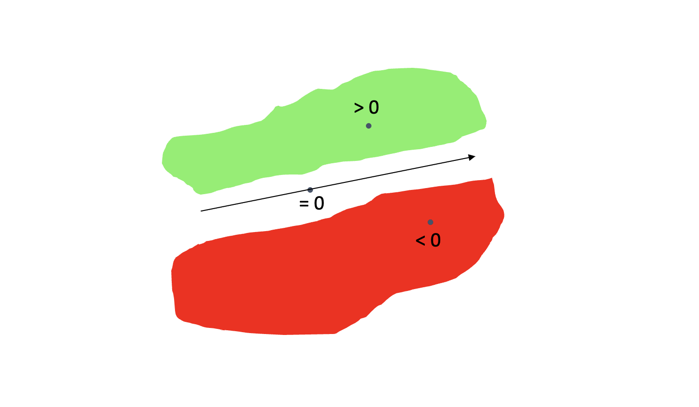
</p>

In code, such a function can look like this:

```JavaScript
getDeterminant(a, b, c) {
    const ab = new Vector(b);
    ab.sub(a);

    const ac = new Vector(c);
    ac.sub(a);

    return ab[1] * ac[0] - ab[0] * ac[1];
}
```

The function receives three inputs `a`, `b` and `c`. The edge coordinates are `a` and `b`, and the candidate pixel coordinates is `c`. (A `Vector` here simply represents an array of values - where the value at index 0 is the x-coordinate, and at the value at index 1 is the y-coordinate.)

The code calculates two vectors `ab` and `ac`. These vectors describe the differences in x- and y-coordinates when going from `a` to `b` and from `a` to `c`. It then cross-multiplies those vectors. This is the same as calculating what is called a determinant - if the vectors were organized in a 2-by-2 matrix. In this tutorial, we will call the result of this calculation a determinant value.

We repeat this edge test for each of the three edges in the triangle - and by doing so we have an inside test for the triangle itself.

## Finding candidate pixels

At this point, we have a working test - as long as the vertices are specified in a counterclockwise order. The next question is: Which pixels should we test?

The first idea could be to just test all pixels on screen, but we can be more efficient than that - we could test just the pixels inside a bounding box enclosing the triangle. This way we test fewer pixels, but still all that are needed. If calculating a bounding box is fast (faster than testing the pixels outside it), then this will be the faster solution.

Taking the minimum and maximum values of all the vertex coordinates gives us the coordinates of the bounding box. This is a very fast operation, so we will use that optimzation here.

In code, finding the corner points of the bounding box looks like this:

```JavaScript
const xmin = Math.min(va[0], vb[0], vc[0]);
const ymin = Math.min(va[1], vb[1], vc[1]);

const xmax = Math.max(va[0], vb[0], vc[0]);
const ymax = Math.max(va[1], vb[1], vc[1]);
```

Here, the `Vectors` `va`, `vb` `vc` contain the vertex coordinates of the triangle.

<p align="center">
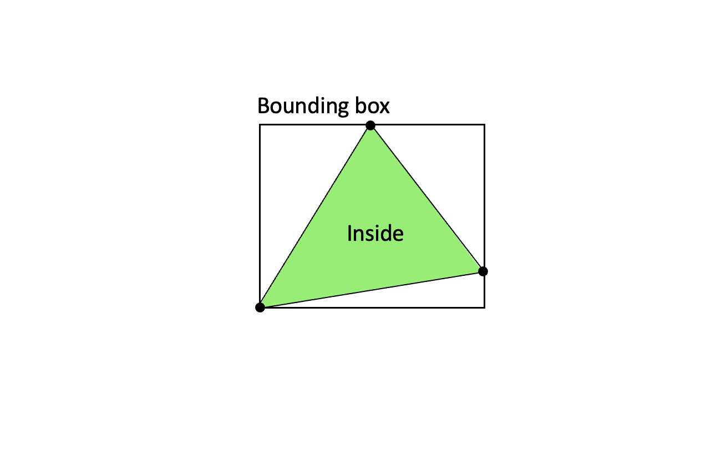
</p>

## Drawing the triangle

Now we have all we need: We can loop through all points inside the triangle bounding box, we can calculate three determinant values (based on each of the triangle edges and the candidate pixel), and if all the determinant values are positive, we know that the candidate pixel is inside the triangle. (The determinant even has the nice property that the value is proportional to the shortest distance between the pixel and the edge.)

If we are inside we paint the pixel with the desired triangle color. (For now we also assume that a pixel exactly on a triangle edge also belongs to that triangle.)

The code could look like this:

```JavaScript
for (let y = ymin; y < ymax; y++) {
    for (let x = xmin; x < xmax; x++) {
        p[0] = x;
        p[1] = y;

        w[0] = getDeterminant(vb, vc, p);
        w[1] = getDeterminant(vc, va, p);
        w[2] = getDeterminant(va, vb, p);

        if (w[0] >= 0 && w[1] >= 0 && w[2] >= 0) {
            drawPixel(p, color)
        }
    }
}
```

The code here draws pixels - something we have not explained yet. Don't worry, we will get to that in the next section - where we go through how to set up the browser to run code and draw pixels one by one.

# 2. Setting up the browser to draw pixels

(This article is part of a [series](#sections). You can jump to the [previous section](#1-a-walkthrough-of-the-method) or the [next section](#3-the-first-basic-rasterizer) if you would like to.)

In this section we will use the `<canvas>` element to draw individual pixels on the screen. This will set the stage for drawing actual triangles - which we will go through in the section after this one.

## The drawing surface

To be able to draw triangles in a browser window, we need a surface to draw on. This is provided by the `<canvas>` tag - a block element that can receive sizing parameters - both as element attributes, _and_ via CSS styling. Why both?

The `width` and `height` properties of `<canvas>` define the number of pixels the canvas will contain - horizontally and vertically.

Most graphical applications use the value of the `window.devicePixelRatio` property to scale the size of the canvas. This way the code can utilize high DPI hardware if you have that.

However, in this tutorial we will set up a low resolution surface. We want each pixel to be large so that we can see what is going on when we draw triangles. We therefore use a custom `devicePixelRatio` value to specify the scale - and a value of 0.2 works well for our case.

```JavaScript
const canvas = document.getElementById("canvas");
const devicePixelRatio = 0.2;

canvas.width = window.innerWidth * devicePixelRatio;
canvas.height = window.innerHeight * devicePixelRatio;
```

When we want to set the _size_ of the element (the extents in the browser window) we use CSS. In JavaScript:

```JavaScript
canvas.style.width = window.innerWidth + "px";
canvas.style.height = window.innerHeight + "px";
```

Together, these code snippets set up a canvas element for us to work on. It covers the entire browser window and will have a resolution along x and y that is 20% of the native resolution for a normal-DPI screen. That means, one canvas pixel will cover 5 pixels in each direction, for a total of 25 pixels.

However, there is still something left. Browsers will in general try to improve low resolution graphics by smoothing out pixels. This means that anything we draw on our canvas would end up looking blurry. We want the opposite: We want to see sharp, boxy pixels on the screen. To achieve that, we style the `<canvas>` element with some CSS that tells the browser not to do smoothing:

```HTML
<canvas id="canvas" style="image-rendering:pixelated;"></canvas>
```

## Pixels in the browser

The canvas element object - that we can access from JavaScript - also has an array that stores the color values for all the pixels it contains. The array contains 4 Uint8 (byte) values per pixel - one value for each of the red, blue, green and transparency (alpha) channels. After those 4 values come the 4 values for the next pixel. The array is one-dimensional, you cannot send it x and y values directly.

<p align="center">
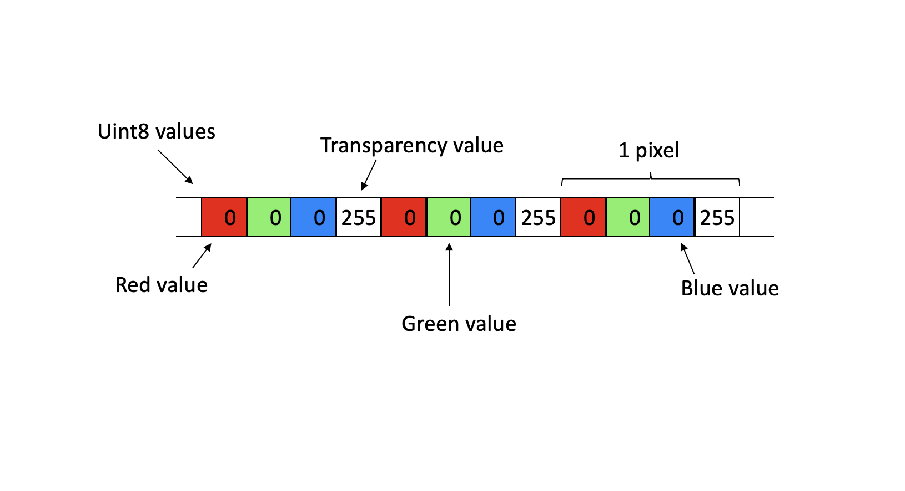
</p>

To draw a pixel at a specific (x, y) location on screen, we need to convert the x and y values to an array index that then will point to the right location in the array. The correct value is `4 * (y * width + x)`. The multiplication by 4 is needed since we address bytes, and there are 4 byte values per pixel. At this array location we can then start writing byte values after each other - red, green, blue and transparency values. The minimum value we can write is 0 (no intensity) and the maximum is 255 (full intensity). The resulting color of the pixel will be a mix of the three color intensities and the transparency. In this tutorial we will not use transparency, so we write a value of 255 - which means a completely opaque pixel.

Note: In the canvas coordinate system, (0, 0) is the top left pixel. The x-axis goes to the right, and the y-axis goes downwards. This is how the array addressing looks like if each pixel consisted of one byte:

<p align="center">

</p>

(As mentioned the array index must be multiplied by 4 since there are 4 bytes in each pixel in our setup.)

When drawing, we will actually not write values directly to the canvas array. Instead, we create a separate array (often called a buffer), draw on that, and then copy the buffer contents over to the canvas array. This way of doing things eliminates flicker that might otherwise appear if we draw directly to the screen while it is being refreshed. The screen refreshes 60 times per second and although we already synchronise our drawing with the screen refresh rate, we will use an intermediate buffer. The reason is that it is more efficient to draw into a buffer in RAM, and then send the full buffer to the GPU in one go, rather than sending lots of small updates directly to the GPU.

How do we create this buffer? First, we need get the so-called `drawing context` for the canvas element:

```JavaScript
const ctx = canvas.getContext("2d");
```

Then, we get hold of the buffer. Note that we need to specify a width and a height, which for us is the same as the full canvas:

```JavaScript
const screenBuffer = ctx.createImageData(window.innerWidth * devicePixelRatio, window.innerHeight * devicePixelRatio);
```

After having set all of the pixel values in the buffer, we put the contents on screen. (The two last parameters specify the pixel location in the canvas where the top left corner of the buffer should be placed).

```JavaScript
ctx.putImageData(screenBuffer, 0, 0);
```

And with that, we have all we need to start drawing triangles in the browser! Let's do that in the next section.

In the mean time, you might want to look at [the code for this section](2) and some [utility classes](lib).

# 3. The first, basic rasterizer

(This article is part of a [series](#sections). You can jump to the [previous section](#2-setting-up-the-browser-to-draw-pixels) or the [next section](#4-moar-triangles-moar-problems) if you would like to.)

In this section, we will _finally_ get to draw a triangle on the screen - using the method we have described in section 1 and the setup code from section 2.

## The application code

Let's get started. Take a look at this code:

```JavaScript
const vertices = [];
vertices.push(new Vector(140, 100, 0));
vertices.push(new Vector(140, 40, 0));
vertices.push(new Vector(80, 40, 0));

const greenTriangleIndices = [0, 1, 2];
const greenTriangle = new Triangle(greenTriangleIndices, screenBuffer);

const color = new Vector(120, 240, 100);

greenTriangle.draw(vertices, color);
```

Here, we create an array of vertex coordinates for three vertices in a triangle, define indices to those vertices, instantiate a `Triangle` object, define a triangle color by its red, green and blue values, and then draw the triangle using the vertex coordinate array and the specified color.

This code relies on the same `Vector` class that we mentioned earlier. We use that for coordinates, colors and other numbers that need to be grouped together.

Note that we set the vertex indices in the constructor, and keep the vertex coordinates in an array by themselves. This way the vertices can be moved around on screen without impacting the basic structure of a triangle - ie which vertices it contains. (We will return to this subject later when we will start animating our triangles.)

Also see that the vertices are specified in counterclockwise order, as mentioned in the first section.

## The triangle code

Let's have a look at the start of the triangle drawing method - ie the actual rasterizer:

```JavaScript
draw(screenCoordinates, color) {
    // get screen coordinates for this triangle
    const va = screenCoordinates[this.va];
    const vb = screenCoordinates[this.vb];
    const vc = screenCoordinates[this.vc];

    const determinant = this.getDeterminant(va, vb, vc);

    // backface culling: only draw if determinant is positive
    // in that case, the triangle is ccw oriented - ie front-facing
    if (determinant <= 0) {
        return;
    }

    (...)

```

The first step is to read out the actual vertex coordinates from the array provided in the parameter, using the indices originally set in the constructor. We name the three vertices `va`, `vb` and `vc`. They are three-dimensional `Vector`s, ie having x, y and z coordinates. (For now we will not use the z coordinates)

We then check the winding order of the triangle vertices. For our rasterizer to work correctly, the vertices must be provided in counter-clockwise order. We use the determinant function to verify this, and only draw the triangle if the determinant value is positive. (If the determinant is zero then the triangle has zero area, and can be skipped).

The next step is to find the minimum and maximum coordinates for the vertices. These form the corner coordinates of the bounding box enclosing the triangle. We also calculate the index in the pixel buffer that points to the pixel at the upper left corner of the bounding box, and the stride (change in index value) when going from one pixel in the buffer to the pixel directly below.

Then we define two `Vector`s, one to hold a variable `w` (that will be explained shortly) and one to hold the variable `p` which contains the x- and y-coordinates of the current candidate pixel.

```JavaScript
    const xmin = Math.min(va[0], vb[0], vc[0]) - 1;
    const ymin = Math.min(va[1], vb[1], vc[1]) - 1;

    const xmax = Math.max(va[0], vb[0], vc[0]) + 1;
    const ymax = Math.max(va[1], vb[1], vc[1]) + 1;

    let imageOffset = 4 * (ymin * this.buffer.width + xmin);

    // stride: change in raster buffer offsets from one line to next
    const imageStride = 4 * (this.buffer.width - (xmax - xmin));

    // w = edge distances
    const w = new Vector();

    // p = screen coordinates
    const p = new Vector();
```

The code that follow looks like this:

```JavaScript
    for (let y = ymin; y < ymax; y++) {
        for (let x = xmin; x < xmax; x++) {
            p[0] = x;
            p[1] = y;

            w[0] = this.getDeterminant(vb, vc, p);
            w[1] = this.getDeterminant(vc, va, p);
            w[2] = this.getDeterminant(va, vb, p);

            if (w[0] >= 0 && w[1] >= 0 && w[2] >= 0) {
                this.buffer.data[imageOffset + 0] = color[0];
                this.buffer.data[imageOffset + 1] = color[1];
                this.buffer.data[imageOffset + 2] = color[2];
                this.buffer.data[imageOffset + 3] = 255;
            }
            imageOffset += 4;
        }
        imageOffset += imageStride;
    }
}
```

We are now at the heart of the rasterizer. We loop through all pixels inside the bounding box and calculate three different determinants, each of them based on two of the triangle vertices plus the current pixel.

We store the determinant values in a vector `w`. If all three `w` components are larger than - or equal to - zero, the pixel will belong to the triangle, and we write RGB and transparency values (as mentioned, the a transparency value of 255 means "not transparent") to the specified offsets in the pixel buffer - before updating the offsets so they keep pointing to the right screen locations when running through the two loops.

Now - the result looks like this:

<p align="center">
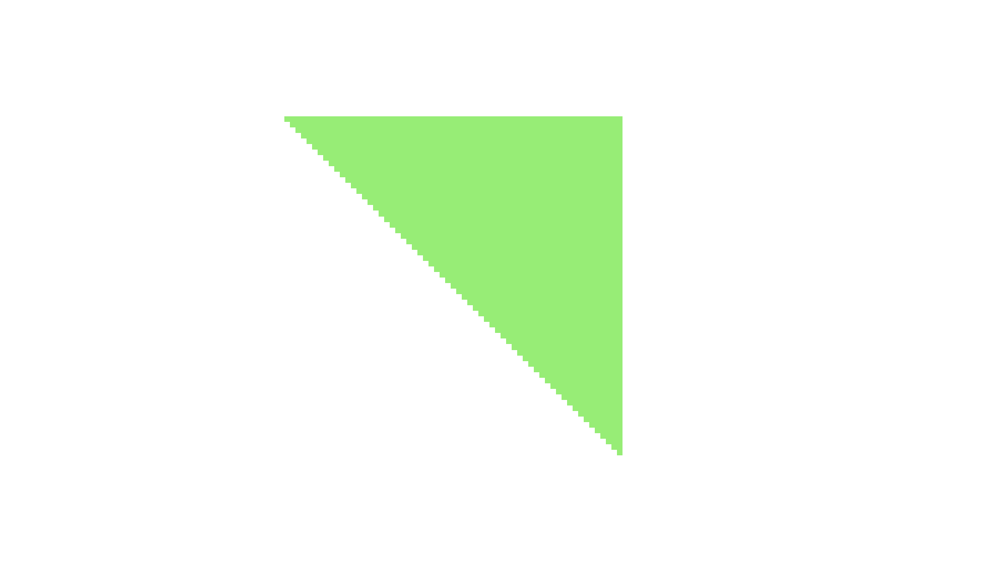
</p>

And with that, we have our first, basic, rasterizer up and running! We will now start refining it.

In the mean time, you might want to look at [the code for this section](3) and some [utility classes](lib). There is also [a running example app](https://kristoffer-dyrkorn.github.io/triangle-rasterizer/3/).

# 4. Moar triangles, moar problems

(This article is part of a [series](#sections). You can jump to the [previous section](#3-the-first-basic-rasterizer) or the [next section](#5-weve-got-to-move-it) if you would like to.)

In this section, we will take a closer look at what happens when we draw two triangles that share an edge. There are some important details here that need to be resolved.

## The application code

It is not so interesting to look at just one triangle on a screen. We need more triangles! So, let's add a blue one. In the application code, it looks like this:

```JavaScript
const vertices = [];
vertices.push(new Vector(140, 100, 0));
vertices.push(new Vector(140, 40, 0));
vertices.push(new Vector(80, 40, 0));
vertices.push(new Vector(50, 90, 0));

const greenTriangleIndices = [0, 1, 2];
const greenTriangle = new Triangle(greenTriangleIndices, screenBuffer);

const blueTriangleIndices = [0, 2, 3];
const blueTriangle = new Triangle(blueTriangleIndices, screenBuffer);

const greenColor = new Vector(120, 240, 100);
const blueColor = new Vector(100, 180, 240);
```

We add another vertex to the array of all vertices, and create a new, separate vertex index array just for the blue triangle. Note that the indices `2` and `0` are shared between the two triangles. This means that the two triangles share an edge - that goes between vertices number 2 and 0.

This is how it looks like:

<p align="center">
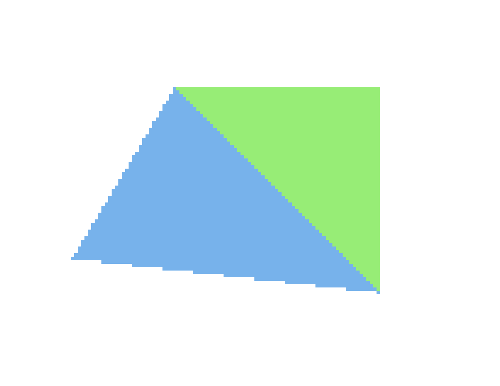
</p>

## Oooops

At first, this seems to look just great. But, if we draw first the green triangle, and then the blue one, and zoom in on this, we will see that there are some blue pixels that are drawn on top of the green ones.

<p align="center">
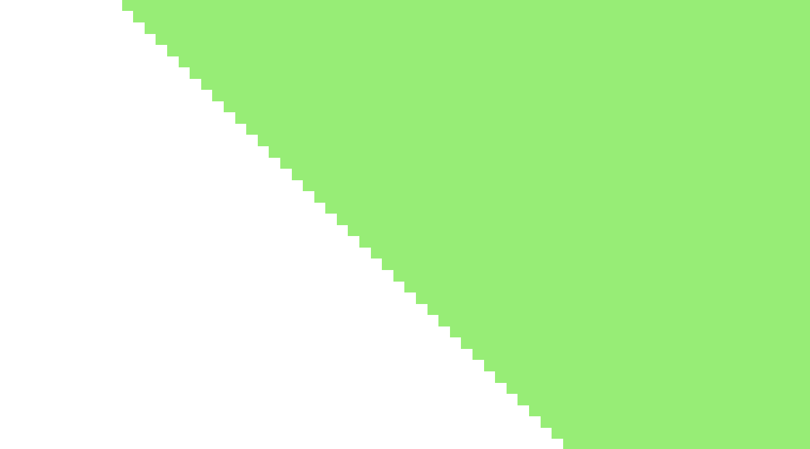
</p>

This is called overdraw - and it is something we want to avoid. First of all, it will worsen performance, since we spend time drawing pixels that later become hidden by other pixels. Also, the visual quality will suffer: It will make edges between triangles seem to move, depending on which triangle was drawn first. Should we want to use the rasterizer to draw detailed 3D objects with many triangles, we will in general have no control over the sequence the triangles will be drawn in. The result will look awful - the edges will flicker.

You might remember from earlier that we considered all pixels lying exactly on a triangle edge (`w` = 0) to belong to the triangle. What we have here is an unfortunate consequence of that: The pixels along the shared edge between two triangles now belong to both triangles. So they are drawn twice.

## One rule to rule them all

We need to sort out that - and introduce another rule for triangles. The rule that most graphics APIs use, is to say that pixels that lie exactly on a left side edge of a triangle, or on a flat top edge of a triangle, do not belong to that triangle. This is sufficient to cover all cases of shared edges - and make all pixels belong to just one triangle.

<p align="center">
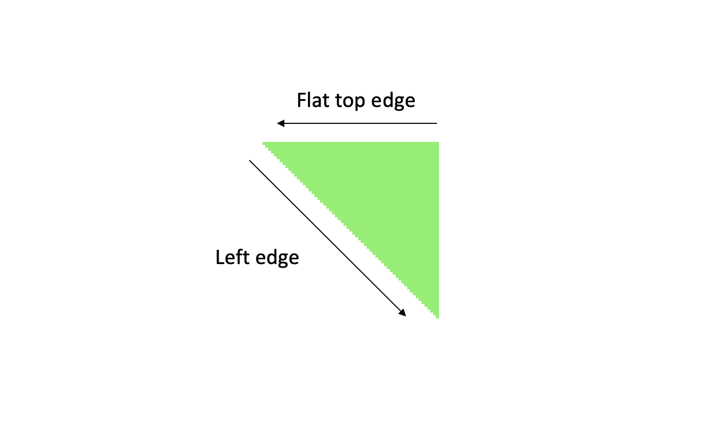
</p>

The rule is often called the "top left" fill rule, and can be implemented like this, in the triangle rasterizer:

```JavaScript
function isLeftOrTopEdge(start, end) {
    const edge = new Vector(end);
    edge.sub(start);
    if (edge[1] > 0 || (edge[1] == 0 && edge[0] < 0)) return true;
}
```

The logic behind is as follows: An edge is a left edge if the change in y coordinate, when moving from the end and to the start of the edge, is larger than zero. An edge is a flat top edge if the change in y coordinate is zero and the change in x is negative.

This way of expressing the fill rule is based on two conventions we already follow in our setup: That the vertices in a visible triangle have counterclockwise order, and that the positive y axis on screen points down. As long as those two hold, then the code will work as intended.

(Side note: We could have chosen the opposite convention, and defined a "bottom right" rule, and that would be just as correct. The point is to have a rule that consistently separates pixels that lie on shared edges, and the "top left" version of this rule has somehow become the standard in computer graphics.)

Now that we have defined the rule, what do we do with it? How do we express that the pixels on the edges that match the rule do not belong to this triangle?

When drawing pixels, we need to make an exception: We will skip those pixels that - according to this new rule - don't belong to the triangle after all. An easy way to do so is to adjust the determinant value. So, whenever an edge is affected by the fill rule (ie is a left edge or a horizontal top edge), we subtract some small amount from that determinant.

This could be considered a dirty trick - since reducing a determinant value essentially moves a triangle edge towards the triangle center. So the adjustment should be as small as possible, while still large enough to work as intended.

The goal here is to make the determinant value for _this_ edge, in the current triangle, differ from the determinant value for pixels on the same edge in the _neighbour_ triangle. This way we create a tie breaking rule - ie some logic that ensures that pixels lying exactly on the shared edge will end up belonging to only one of the triangles - and are thus drawn only once.

How large should the adjustment be? In the setup we have here, all coordinates have integer values. This means that all determinants also have integer values. The resolution - or, smallest expressible value - of the determinant calculation is 1 and that, in turn, means that the smallest possible adjustment value is 1.

```JavaScript
if (isLeftOrTopEdge(vb, vc)) w[0]--;
if (isLeftOrTopEdge(vc, va)) w[1]--;
if (isLeftOrTopEdge(va, vb)) w[2]--;

if (w[0] >= 0 && w[1] >= 0 && w[2] >= 0) {
    this.buffer.data[imageOffset + 0] = color[0];
    this.buffer.data[imageOffset + 1] = color[1];
    this.buffer.data[imageOffset + 2] = color[2];
    this.buffer.data[imageOffset + 3] = 255;
}
```

The rest of the code remains the same.

And with that, we can safely draw lots of triangles - without gaps or overlaps! But, we are not done yet. We will now start animating the triangles.

In the mean time, you might want to look at [the code for this section](4) and some [utility classes](lib). There is also [a running example app](https://kristoffer-dyrkorn.github.io/triangle-rasterizer/4/).

# 5. We've got to move it

(This article is part of a [series](#sections). You can jump to the [previous section](#4-moar-triangles-moar-problems) or the [next section](#6-lets-go-continuous) if you would like to.)

In this section, we will start animating our triangles - we will make them rotate on the screen!

## The application code

To make our triangles rotate, it is sufficient to make the vertices rotate. Remember, the triangle objects themselves just contain references to vertex coordinates, so as long as the values in the vertex coordinate array are updated, everything will be correct.

Also, the notion of sharing edges and vertices might become clearer now: By making triangles share vertices, we save calculations: It is sufficient to rotate a vertex just once, and all triangles that use that vertex will then be updated. Also, if we instead had chosen to duplicate vertices among triangles, there is a risk that small errors in calculations might move duplicate vertices apart, thus creating cracks or overlaps between the triangles. We would very much like to avoid that. (We will return to the topic of precision later on in this tutorial.)

Now, back to the code. We start by keeping our existing vertex coordinate array as it is. In addition, we create an array that will hold our rotated vertices, and we initialize it to contain empty `Vector` objects.

```JavaScript
const rotatedVertices = Array.from({ length: 4 }, () => new Vector());
```

To rotate the vertices, we first move them so all vertices are centered around origo, then do the rotation, and then move them back to where they originally were centered. This way we make them rotate around their own centers. (If we don't move them to origo before rotating, they would instead rotate around the _screen coordinates_ origo, which is the top left corner of the screen.) Then we round the result to the nearest integer pixel coordinate, and store the values in the array of rotated vertices.

```JavaScript
function rotate(angle) {
    const DEG_TO_RAD = Math.PI / 180;

    for (let i = 0; i < 4; i++) {
        const v = new Vector(vertices[i]);
        v.sub(center);

        const r = rotatedVertices[i];
        r[0] = Math.round(v[0] * Math.cos(angle * DEG_TO_RAD) - v[1] * Math.sin(angle * DEG_TO_RAD));
        r[1] = Math.round(v[0] * Math.sin(angle * DEG_TO_RAD) + v[1] * Math.cos(angle * DEG_TO_RAD));

        r.add(center);
    }
}
```

In each full screen repaint, we base all our calculations on the same unrotated vertices, and just increase the rotation angle a little bit per frame. This way we make the vertices (this, the triangles as well) rotate. We could also have decided to start with the coordinates from the previous screen paint, and rotate them with some fixed, small amount, but that would mean that small errors in the calculations would accumulate. So doing everything from scratch is more precise - and has no performance penalty. (The work to rotate vertices stays the same, only the rotation amount changes.)

In the code, we set up a function that will be run each frame. Inside the function, we first rotate the vertices, clear the pixel buffer, draw the triangles into the buffer, and then put the buffer onto the screen - and increase the rotation angle.

We use the `requestAnimationFrame` method to synchronise the drawing and rotation with the screen refresh rate. The code looks like this:

```JavaScript
 function draw() {
    requestAnimationFrame(draw);

    rotate(angle);
    screenBuffer.data.fill(0);
    greenTriangle.draw(rotatedVertices, greenColor);

    if (drawBlue) {
        blueTriangle.draw(rotatedVertices, blueColor);
    }

    ctx.putImageData(screenBuffer, 0, 0);
    angle += angleSpeed;
}
```

We are now ready to inspect the results. Not bad - the triangles are indeed rotating, but notice: The movement is not smooth - the triangles seem to jump around a bit as they rotate.

<p align="center">
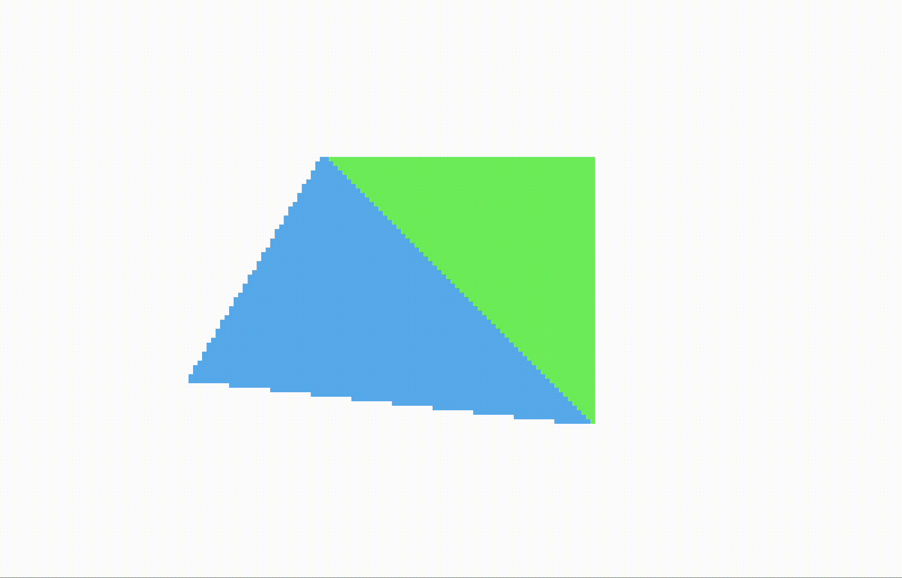
</p>

This can be improved! We will have a look at that in the next section.

In the mean time, you might want to look at [the code for this section](5) and some [utility classes](lib). There is also [a running example app](https://kristoffer-dyrkorn.github.io/triangle-rasterizer/5/).

# 6. Let's go continuous!

(This article is part of a [series](#sections). You can jump to the [previous section](#5-weve-got-to-move-it) or the [next section](#7-one-solution-but-two-new-problems) if you would like to.)

In this section, we will improve the smoothness of the animation.

So far, we have only used integer values when drawing things on screen. But, as we rotate our triangles, the new vertex coordinates will get non-integer values. We have - until now - rounded coordinates off to integers before sending them to the rasterizer. This means that all calculations in the rasterizer will be performed on coordinate values that are slightly shifted around a bit. The shifts are small (less than one pixel) but will have random magnitude and direction, and the result is that the triangles will jump around a bit as they rotate.

One way to improve on the situation is to base the calculations in the rasterizer directly on floating point values coming from the rotated vertices.

We will still need to put pixels on the screen using integer coordinates, since that is the only way to address the screen buffer, but from now on we will do so without first rounding the vertex coordinates.

The effect can be illustrated by looking at line drawing - and what happens if one of the line end points (here marked with red dots) stays fixed while the other is slowly moving downwards inside a single pixel.

<p align="center">
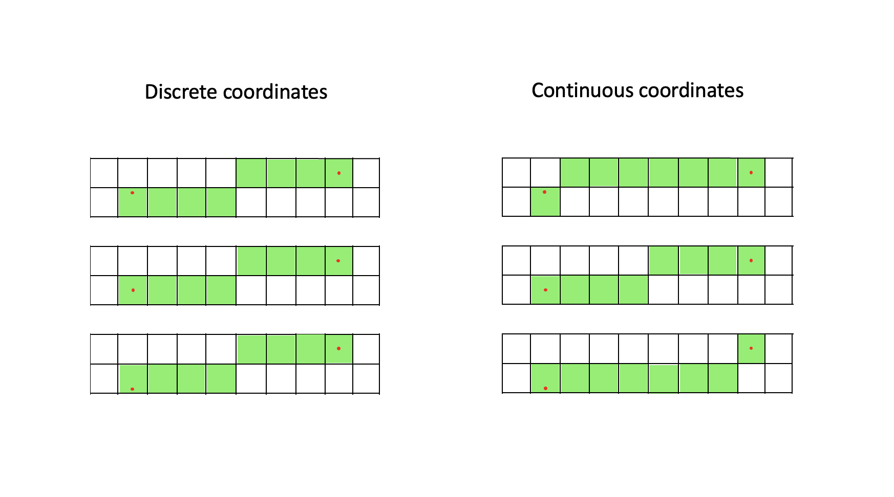
</p>

When using discrete coordinates, the rounding will move the end point to the the pixel centre - so the line will look the same in all three cases. But, when using continuous coordinates, the position of the moving endpoint will have an influence on how the line is drawn.

So, we will now evalute triangle candidate pixels in a different way than before. Let's have a closer look.

## The application code

In the application, the only change we will make is that we don't round off the rotated vertex coordinates. The `rotate(angle)` function now looks like this:

```JavaScript
function rotate(angle) {
    const DEG_TO_RAD = Math.PI / 180;

    for (let i = 0; i < 4; i++) {
        const v = new Vector(vertices[i]);
        v.sub(center);

        const r = rotatedVertices[i];
        r[0] = v[0] * Math.cos(angle * DEG_TO_RAD) - v[1] * Math.sin(angle * DEG_TO_RAD);
        r[1] = v[0] * Math.sin(angle * DEG_TO_RAD) + v[1] * Math.cos(angle * DEG_TO_RAD);

        r.add(center);
    }
}
```

## The triangle code

In the rasterizer, we now receive floating point coordinates. However, we would still like our bounding box to be defined by integer coordinates. We still loop over pixel coordinates (integer values) when we check whether pixels should be drawn or not. So we want an easy way to calculate and keep track of the final screen coordinates for the pixels we are going to draw.

We use rounding up or down (depending on whether we look at min or max values) to modify the bounding box so it at least covers the triangle, and expands out to the nearest integer coordinates.

```JavaScript
const xmin = Math.floor(Math.min(va[0], vb[0], vc[0]));
const ymin = Math.floor(Math.min(va[1], vb[1], vc[1]));

const xmax = Math.ceil(Math.max(va[0], vb[0], vc[0]));
const ymax = Math.ceil(Math.max(va[1], vb[1], vc[1]));
```

Now comes the important part: We no longer use integer values when calculating the determinant values.

The vertex coordinates used to be integers, and refer to a location in a grid of discrete values, but now they represent a point within a continuous two-dimensional space. The edges between vertices also exist in this continuous space.

How can ve convert the edges over to integer coordinates for pixel drawing?

We can imagine putting a grid, with a spacing of 1 by 1, on top of the continuous vertex space. The grid lines intersect the integer values of this continuous space, and the grid cells represent pixels.

<p align="center">
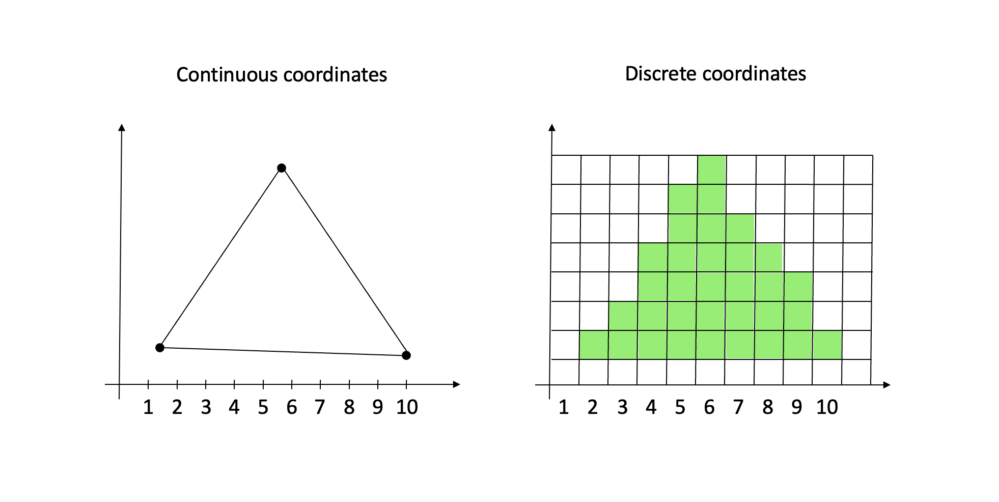
</p>

This means that pixel edges lie at integer coordinates, and that pixel centers are located at (integer) + 0.5 coordinate values.

<p align="center">
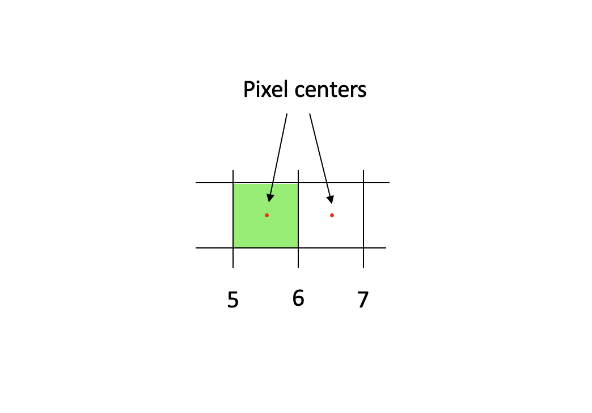
</p>

When we now draw a triangle, we loop through all coordinates inside our integer bounding box, and calculate the determinant value at pixel centers, ie at integer coordinates where we have added 0.5 along both axes. So the triangle will need to cover those points for pixels to be drawn. (The illustration here only shows candidate points near the right triangle edge.)

<p align="center">
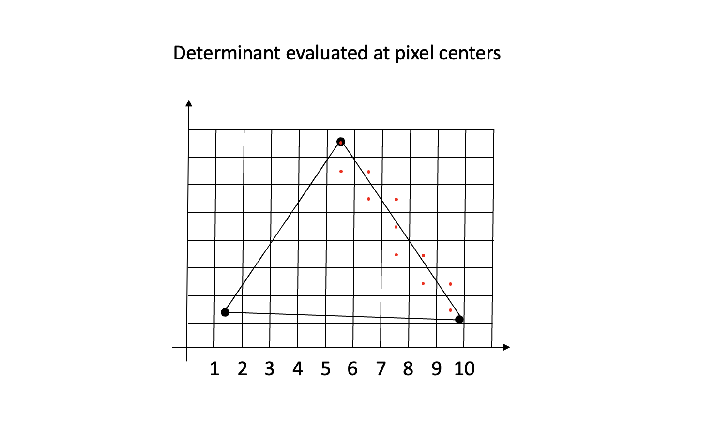
</p>

The code looks like this:

```JavaScript
for (let y = ymin; y < ymax; y++) {
    for (let x = xmin; x < xmax; x++) {
        p[0] = x + 0.5;
        p[1] = y + 0.5;

        w[0] = this.getDeterminant(vb, vc, p);
        w[1] = this.getDeterminant(vc, va, p);
        w[2] = this.getDeterminant(va, vb, p);

        if (isLeftOrTopEdge(vb, vc)) w[0]--;
        if (isLeftOrTopEdge(vc, va)) w[1]--;
        if (isLeftOrTopEdge(va, vb)) w[2]--;

        if (w[0] >= 0 && w[1] >= 0 && w[2] >= 0) {
            this.buffer.data[imageOffset + 0] = color[0];
            this.buffer.data[imageOffset + 1] = color[1];
            this.buffer.data[imageOffset + 2] = color[2];
            this.buffer.data[imageOffset + 3] = 255;
        }
        imageOffset += 4;
    }
    imageOffset += imageStride;
}
```

The choice of adding (and not subtracting) 0.5 is made since then we don't have to deal with any negative coordinate values anywhere in our coordinate systems on screen. (If we subtracted 0.5, the left half of the leftmost pixels on screen would have a negative x coordinate). (See [this article](https://www.realtimerendering.com/blog/the-center-of-the-pixel-is-0-50-5/) for details.)

To summarize: We keep the input vertex coordinates as they are (floating point values), and calculate a slightly larger bounding box, having integer coordinates, that encloses the triangle. We then calculate the determinant at each (integer) + 0.5 location, and use the result to decide whether to draw that pixel or not. The net effect is that the location of the vertices inside their pixel grid cell (ie, the fractional values of the vertex coordinates) are kept in consideration in all of the determinant calculations along the triangle edges. The result is that the rasterizer will now reproduce the definition of the triangle (belonging in a continuous coordinate space) on screen (on a discrete pixel grid) in a much more precise way as. Just as the line drawing example in the very beginning of this section illustrated.

Here is the result - the two triangles now rotate smoothly. This looks good!

<p align="center">
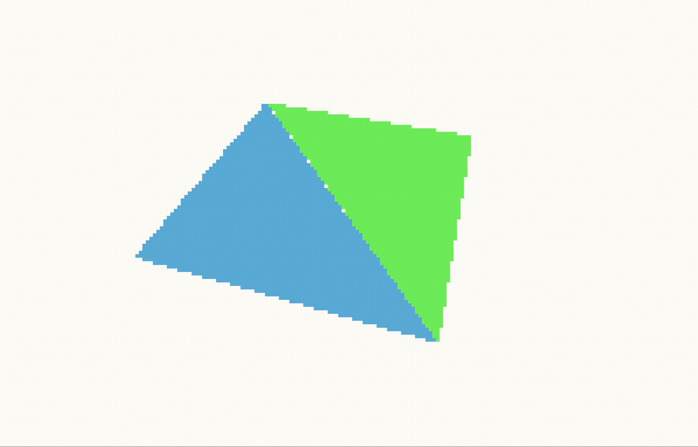
</p>

But wait - there is something wrong here: Now and then there are white single-pixel gaps along the edge between the triangles. The fill rule is correct and we do use floating point numbers (with double precision, even). What is wrong? We will figure out that next.

In the mean time, you might want to look at [the code for this section](6) and some [utility classes](lib). There is also [a running example app](https://kristoffer-dyrkorn.github.io/triangle-rasterizer/6/).

# 7. One solution, but two new problems

(This article is part of a [series](#sections). You can jump to the [previous section](#6-lets-go-continuous) or the [next section](#8-lets-fix-this) if you would like to.)

## Floating-point numbers

The rasterizer runs on floating point numbers, and uses the rotated vertex coordinates as input for the determinant calculations.

The artifacts we see are gaps between triangles. Does this problem somehow involve the fill rule? Well, yes. Until now we have used an adjustment value of 1, and that has consistently nudged the determinant values so that pixels are not overdrawn, and the triangles have no gaps. The value 1 is the least possible value that will separate pixels exactly on an edge shared between two neighbor triangles - as long as we use integer coordinates.

But now we get gaps. The reason is that we now have higher resolution in all our calculations. We are using floating point values when we place vertices, and those values are used directly as input for the determinant calculations. The smallest possible difference between two floating point values is much smaller than 1 – so now we create an unnecessary large separation between neighboring edges.

Actually, the smallest possible difference is not even a constant number. In a floating point representation, the resolution (the shortest distance between two values that can be represented exactly) depends on the value itself. Let's look at this in detail.

As an example, let's create a toy floating point format that follows the same structure as the floating point representation used in our code. This example format might not be particularly useful in practice, but for now let's ignore that.

Let's set aside 3 decimal digits to store the numberic value. As in the floating point standard, the total number of digits is fixed, but the decimal can be placed anywhere between the digits. If we ignore negative numbers, the smallest possible value we can represent is 0. The next larger values are 0.01, 0.02, 0.03 and so on. That is, we have a resolution of 0.01. At a value of 9.99 the next larger value becomes 10.0, and after that the next numbers are 10.1, 10.2 and 10.3. So, the resolution has become 0.1. After 99.9 comes 100, and then we are at integer resolution - all the way up to the maximum value of 999.

<p align="center">
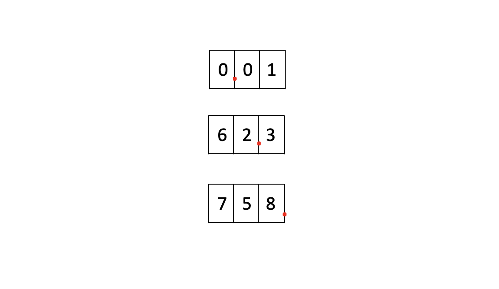
</p>

So - the smallest possible value we can use when nudging our determinant will depend on the value of the determinant itself! That sounds a bit complicated, but is an artifact of the floating point representation (the IEEE 754 standard). In numerics, this smallest difference - which we have called resolution here - is called ULP (Unit of Least Precision).

Also, as long as we use floating point numbers only some numbers along the number line can be represented exactly. The rest will be nudged to the nearest available value. Here is an example of representable numbers in a low-precision floating point format. An ULP is the gap between two short tick marks.

<p align="center">
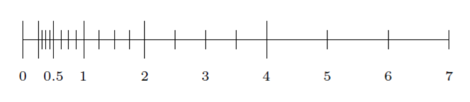
</p>

Since the size of an ULP varies, we will have varying degrees of exactness in number representations when using floating point. As an example, see for yourself what the answer to 0.1 + 0.2 is in JavaScript (which is the language we have used here). Although JavaScript uses double precision (64 bits) when handling numbers, that is still not sufficient. Also, the answer has nothing to do with JavaScript itself - this is due to floating point numbers, and to expected by any language that follows IEEE 754 correctly.

We also hit upon another difficulty: The calculation of the determinant value itself will not necessarily be correct. The resolution we will get will be higher than when using integer values, but the mathematical operations we use to calculate determinants (subtraction and multiplication) are lossy in the floating point domain: Subtractions can incur information loss (due to [catastrophic cancellation](https://en.wikipedia.org/wiki/Catastrophic_cancellation)), and multiplications will scale up errors. This means that the calculated determinant value likely will deviate from what you would get when using pen and paper. It even turns out that determinant calculations are especially tricky to handle (see for example [this article](https://observablehq.com/@mourner/non-robust-arithmetic-as-art)).

So, here we have two problems: The determinant values themselves will be imprecise, and at the same time we don't know what a suitable adjustment value will be. We need to ensure separation for the tie-breaker rule to work correctly, but here the base results as well as the adjustments are uncertain.

Fortunately, we don't have to solve the problems. Instead, we can use a different representation of our vertex coordinates and determinant values. We can use what is called fixed point numbers. And then, seemingly by magic, both problems disappear!

What is a fixed point number? Let's have a look.

Like in a floating point representation, we will set a side a given number of digits. But instead of letting the comma be placed anywhere between digits, we will fix it: We place it at the same location for all numbers, hence the name fixed point.

As an example, assume we set a side 4 digits in total, and use 2 digits for the integer part and 2 digits for the fractional part of a number. If we ignore negative numbers we can now represent a numerical range from 0 to 99.99, and the resolution is constant across the entire value range: 0.01. This is convenient. And here comes an extra trick: We can use integers to store these numbers - by storing the original value multiplied by a constant. Assuming we set aside 2 digits for the fractional part, the constant we will then need to multiply by is 100 (10^2). So, the number 47.63 will be represented - and stored - as an integer value of 4673. We can even use normal integer operations to do maths on fixed point numbers. They behave just like integers for addition, subtraction, multiplication and division. When we need to read out the actual value, we divide the fixed point number by the same constant we multiplied by earlier.

Fixed point numbers is the industry standard way to handle the precision problem in triangle rasterization: We use a number representation that provides higher resolution than pure integers, but still gives exact results, and allows us to use fast integer operations for the calculations we need.

But - what happened to the adjustment value? In a fixed point representation there is again such a thing as a smallest possible adjustment value. Our fixed point numbers have a a known resolution (that is constant across the entire value range), and that is exactly the value we want to adjust by. Just as in our old integer-based code. So things are now under control. But now, let us look some more at how we use this number representation.

## Practicalities

How do we create fixed point numbers? If we take a floating point number, multiply it by some integer value, and round off the result to an integer, we have made a fixed point representation of the original floating point number.

The multiplication and rounding effectively subdivides the fractional part of the original number into a fixed set of values - ie we quantize the fractional part. This means that we cannot represent all values that a floating point number might have, but we do get the advantage that all mathematical operations on numbers can be realized by their integer variants. So within the available precision we choose for our fixed point numbers, the calculations will be fast and exact. And, as long as we multiply the input by a large enough number we will achieve enough resolution in the fractional part to reach the same animation smoothness as we had when using floating point numbers. At the same time, we still keep the correctness and speed we saw in the pure integer implementation. Put differently, we accept some (bounded) precision loss when converting to fixed point, in exchange for correct - and faster - calculations.

The number we choose to multiply by should be some number 2^n. Then we can convert from a fixed point representation back to a normal number very efficiently. Instead of dividing by 2^n we can bit-shift the number n positions to the right. That is much much faster - but only works for division by 2^n.

This is how bit shifting can replace division:

<p align="center">
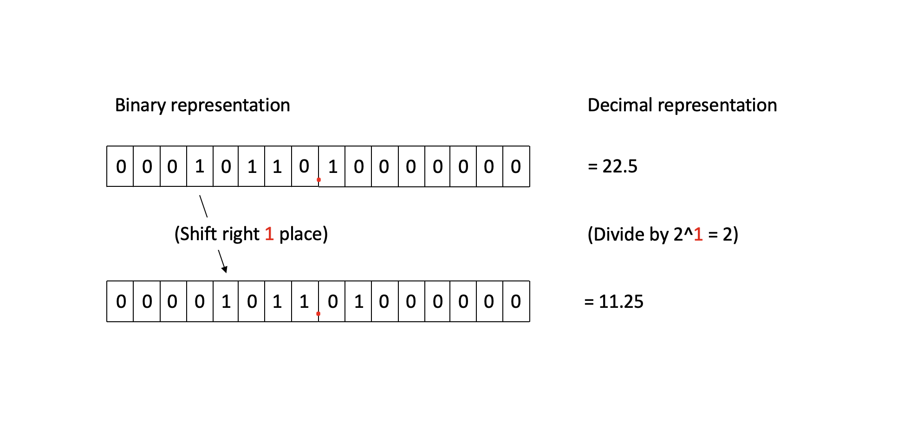
</p>

When we bit-shift n places, we get the same result as division without rounding. This will also remove the fractional part of the number, so it is essentially a `trunc` or `floor` operation. If we need to support proper rounding we should add the value 0.5 (converted to fixed point representation) before bit-shifting.

Now, which number 2^n would be right to use? A large number will give us high resolution in the fractional part, but take more space (more bits of storage). And we need to keep both the integer and fractional part within a number of bits that is easily supported by our hardware. Here we choose to use a 32-bit (signed) integer type. We must reserve one bit of storage for the sign (since we need to support negative numbers), so the total amount of bits we can spend on the integer and fractional parts are 31.

If we assume the x and y screen coordinates will be inside the range 0..2048, the integer part would fit inside 11 bits (2^11 = 2048). However, when we calculate the determinant we multiply two fixed point numbers together, and to handle that properly we must set aside double that space. So we need 22 bits for the magnitude - and can spend up to 9 of the remaining bits for the fractional part.

## Fixed point numbers, pixels and subpixels

The structure of a fixed point number actually has some relation to the pixels we see on screen.

It is here useful to introduce the concept of subpixels. Let's assume that each whole pixel we see on screen can be divided into smaller invisible parts, subpixels. The integer part of a fixed point screen coordinate lets us address a whole pixels, and the fractional part lets us address subpixels. So using fixed point coordinates lets us address each subpixel individually and exactly.

This is how a pixel containing 64 subpixels looks like:

<p align="center">
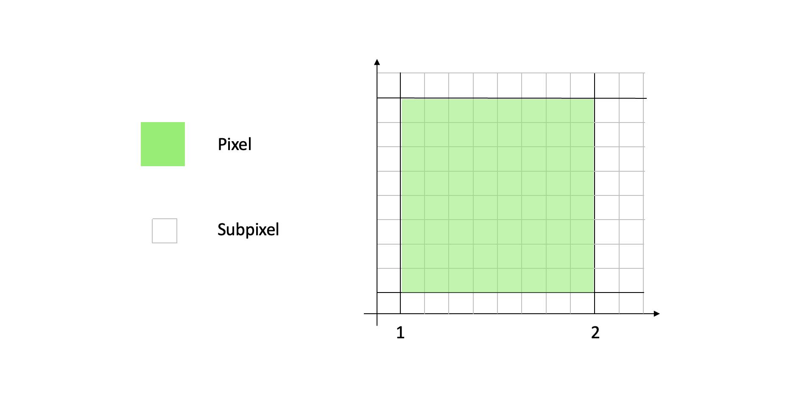
</p>

Another way to look at this is to imagine that we create a higher-resolution "invisible grid" of the screen, and perform exact integer calculations on that grid, all while keeping our drawing operations running on the normal pixel grid. In addition, all floating point coordinates undergo the exact same quantization step when they are converted to fixed point numbers. That means they will be snapped to their nearest subpixel location. This is the same type of pixel shifting we saw early on, when we rounded floating point numbers to integers, but now the magnitude of the shifts is much smaller, and it does not visibly affect the smoothness of the animation.

## Code

How smooth does the animation need to be? How many bits should we set aside for the fractional part? If you test some values, you will likely see that you get few noticeable improvements after spending more than 4 bits on the fractional part. So we have chosen that convention here. (The standard for GPUs nowadays seems to be 8 bits of subpixel resolution.)

Choosing 4 bits means we multiply all incoming floating point numbers by 2^4 = 16 before rounding the result off to an integer, and then store that result in an integer variable. To get from a fixed point representation back to a normal number we shift the fixed point number right by 4 places. As mentioned, this conversion essentially is a truncation (a `floor` operation), so to do proper rounding we will need to add 0.5 (in fixed point representation, meaning, an integer value of 8) to the number before shifting to the right.

In the application code, all of the fixed point operations we need for the rasterizer are implemented in the class `FixedPointVector`. We will not go through that code here. However, in the next section we will look at how we can convert the rasterizer to use this new and exciting number representation.

There is no code for this section, but I promise: There will be code for the next one.

# 8. Let's fix this

(This article is part of a [series](#sections). You can jump to the [previous section](#7-one-solution-but-two-new-problems) or the [next section](#9-time-to-go-incremental) if you would like to.)

In this section, we will convert the rasterizer to use fixed point coordinates. We have already implemented a `FixedPointVector` class to help us, so the walkthrough here only considers the changes to the application and to the rasterizer itself.

When calculating the determinant we now refer to input vectors as `FixedPointVectors`. Apart from that, there are no changes - the two vector classes we use have the same API.

```JavaScript
getDeterminant(a, b, c) {
    const ab = new FixedPointVector(b);
    ab.sub(a);

    const ac = new FixedPointVector(c);
    ac.sub(a);

    return ab[1] * ac[0] - ab[0] * ac[1];
}
```

At the start of the triangle draw method, we convert the incoming floating point screen coordinates to fixed point coordinates by using the built-in constructor in `FixedPointVectors`:

```JavaScript
draw(screenCoordinates, color) {
    // get screen coordinates for this triangle
    const va = new FixedPointVector(screenCoordinates[this.va]);
    const vb = new FixedPointVector(screenCoordinates[this.vb]);
    const vc = new FixedPointVector(screenCoordinates[this.vc]);

    const determinant = this.getDeterminant(va, vb, vc);

    // backface culling: only draw if determinant is positive
    // in that case, the triangle is ccw oriented - ie front-facing
    if (determinant <= 0) {
        return;
    }

    (...)
```

When we create the bounding box, we no longer have the `Math.floor()` and `Math.ceil()` functions avaiable, so we round the values up and down manually when we convert from fixed point numbers to normal integers:

```JavaScript
const xmin = Math.min(va[0], vb[0], vc[0]) >> FixedPointVector.SHIFT;
const ymin = Math.min(va[1], vb[1], vc[1]) >> FixedPointVector.SHIFT;

const xmax = (Math.max(va[0], vb[0], vc[0]) + FixedPointVector.DIVISION_CEILING) >> FixedPointVector.SHIFT;
const ymax = (Math.max(va[1], vb[1], vc[1]) + FixedPointVector.DIVISION_CEILING) >> FixedPointVector.SHIFT;
```

Also, our `w` vector and the candidate point vector `p` need to change type:

```JavaScript
   // w = edge distances
    const w = new FixedPointVector();

    // p = screen coordinates
    const p = new FixedPointVector();

    for (let y = ymin; y <= ymax; y++) {
      for (let x = xmin; x <= xmax; x++) {
        // there is no need to round off the result.
        // the input is an integer, and although we add 0.5 to it,
        // we then multiply by 2^n (n>0), which means the result will always be an integer
        p[0] = (x + 0.5) * FixedPointVector.MULTIPLIER;
        p[1] = (y + 0.5) * FixedPointVector.MULTIPLIER;
```

The final part now is to update the fill rule to operate on fixed point numbers. Again, the APIs of the two vector classes are the same, so the change is very small.

```JavaScript
function isLeftOrTopEdge(start, end) {
    const edge = new FixedPointVector(end);
    edge.sub(start);
    if (edge[1] > 0 || (edge[1] == 0 && edge[0] < 0)) return true;
    return false;
}
```

Regarding the fill rule, there is an important detail here: When we used integer coordinates in the rasterizer, the adjustment value was 1 - since that was the numerical resolution (ULP). Independent of our current use of fixed point coordinates, we still want the adjustment value to equal the resolution of the numeric representation. And that value is now 1 - _in fixed point representation_. So although the code does not seem to have changed, the meaning of the number 1 here has changed.

```JavaScript
if (isLeftOrTopEdge(vb, vc)) w[0]--;
if (isLeftOrTopEdge(vc, va)) w[1]--;
if (isLeftOrTopEdge(va, vb)) w[2]--;
```

And that is all that's needed in the rasterizer! Sweet! We now have a fully working and correct rasterizer that gives us smooth animation, due to subpixel resolution support.

If you want to test out various subpixel resolutions and see the effects yourself, you can adjust the value of the `FixedPointVector.SHIFT` constant (at the end of [this file](https://github.com/kristoffer-dyrkorn/software-renderer/blob/main/tutorial/lib/fixedpointvector.js)). Try out values like 0 (no subpixels - ie back to a pure-integer version), 1, 2, 4, and 8 for example.

```JavaScript
FixedPointVector.SHIFT = 4;
```

However, the code - as it is now - is not particularly fast. Let's add some simple timing code around the triangle draw function in the application code:

```JavaScript
let start = performance.now();
greenTriangle.draw(rotatedVertices, greenColor);
triangleDrawTime += performance.now() - start;

if (frameCounter % 100 == 0) {
    console.log(`Triangle time: ${(triangleDrawTime / frameCounter).toFixed(2)} ms`);
}
```

When running the code on my machine, drawing the green triangle takes around 2.3 ms. That is actually quite a long time. Here, each triangle consists of only a few pixels (remember, the pixels we see on screen are very large) and does not require a lot of work to draw, but we still would not be able to draw and animate more than 7 triangles on screen before the movement would start stuttering. The browser draws 60 frames per second, so for everyting to run smoothly we must keep at least the same tempo. That means we have a budget of 16.7 ms per frame to draw and animate everything. And `7 triangles` times `2.3 ms per triangle` equals 16.1 ms, so 7 triangles will be the max.

The profiler in my browser tells me that we spend a lot of time calculating determinants, evaluating the fill rule and instantiating `FixedPointVectors`. Could we speed up our code? Yes we can! In the next section we will do just that.

The [code for this section](8) and some [utility classes](lib) is also available. There is also [a running example app](https://kristoffer-dyrkorn.github.io/triangle-rasterizer/8/).

# 9. Time to go incremental

(This article is the last part of a [series](#sections). You can jump to the [previous section](#8-lets-fix-this) if you would like to.)

In this section we will improve the performance of the rasterizer. We would like to draw our triangles much faster so we can show and animate a lot more triangles at the same time. Hopefully we can do this without making the code much more complicated or harder to read.

One way to optimize code for performance is to look for blocks of code that are executed many times, and see if there is a way to change the work that happens there into something that will run faster. We can also try to redistribute work - so that tasks that are executed many times are moved to a place where they need to happen fewer times. Of course, the total computation must be kept unchanged so the program works as before.

The plan here is to restructure the work so the heavy, time-consuming calculations happen once per triangle draw call. Also, we will make the calculations that have to happen once per pixel run as quickly as possible.

## Going incremental

Right now, we calculate one determinant and evaluate one fill rule per edge, per pixel, inside the enclosing bounding box. That is, we calculate everything from scratch for each pixel and do not reuse any of the previous calculations.

A common optimization trick is to try to calculate things incrementally. That means to start by performing an initial and heavy calculation once, and then to update the result as needed with small (lighter) changes.
Whether this trick improves the performance or not depends on whether the small changes can be calculated easily.

It turns out we can apply this trick here. We can do the full determinant and fill rule calculation for just one pixel, and then apply the change - when going from one pixel to the next - on top of the previous result.

<p align="center">

</p>

In this situation, we are lucky, since if you do the math (which we won't here) the change in determinant value per pixel - both horizontally and vertically - is constant. The math might be understood intuitively if you recall that the determinant value is proportional to the shortest distance from a candidate pixel to a triangle edge. That means the change in value only depends of the slope of the triangle edge - and as long as both the triangle edges and the scan directions are straight lines the change is constant.

<p align="center">
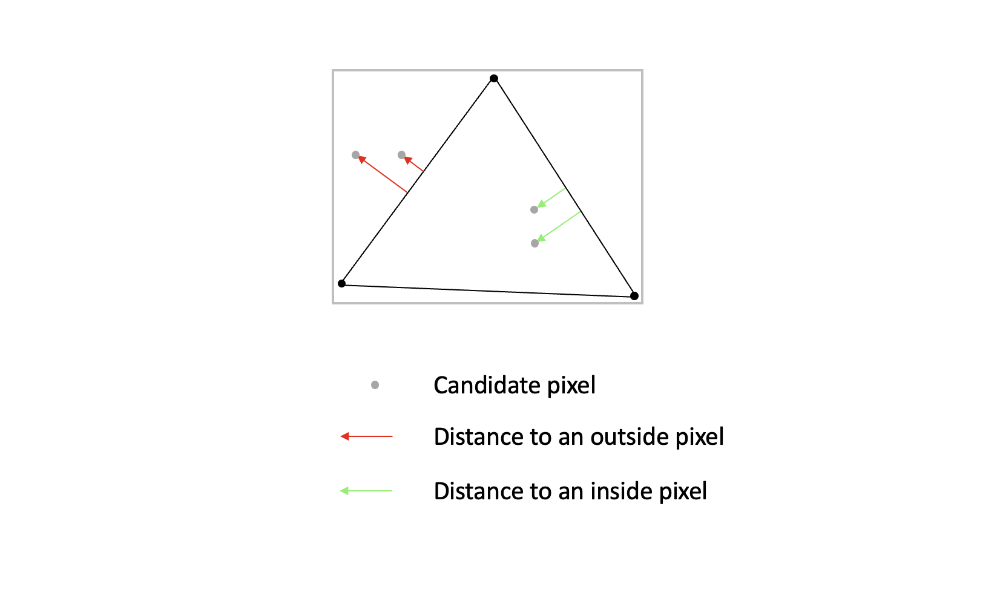
</p>

The change is also easy to calculate. That means that we can update the current (running) determinant value very quickly.

This is how we change the code:

```JavaScript
// screen coordinates at the starting point (top left corner of bounding box, at pixel center)
const topLeft = new FixedPointVector(xmin + 0.5, ymin + 0.5, 0);

// calculate edge distances at starting point
const wLeft = new FixedPointVector();
wLeft[0] = this.getDeterminant(vb, vc, topLeft);
wLeft[1] = this.getDeterminant(vc, va, topLeft);
wLeft[2] = this.getDeterminant(va, vb, topLeft);

if (isLeftOrTopEdge(vb, vc)) wLeft[0]--;
if (isLeftOrTopEdge(vc, va)) wLeft[1]--;
if (isLeftOrTopEdge(va, vb)) wLeft[2]--;
```

We use the top left corner of the bounding box as the starting point. We then calculate the three determinants for that pixel, and put the result in the `wLeft` variable. We also calculate the fill rule adjustment for this pixel.

Since the adjustments are constant across entire triangle edges, we can calculate all determinants for the first pixel, apply the adjustments, and then all the consecutive pixels that we are going to draw inside the bounding box will already have been adjusted. So we only need to evaluate the fill rule once. The incremental calculations take place on top of the initial adjustment.

We now calculate the change in determinant values when moving from one pixel to the next, both horizontally (`dwdx`) and vertically (`dwdy`). As you can see, finding the change per pixel is a very lightweight operation:

```JavaScript
const dwdx = new FixedPointVector();
dwdx[0] = (vb[1] - vc[1]) << FixedPointVector.SHIFT;
dwdx[1] = (vc[1] - va[1]) << FixedPointVector.SHIFT;
dwdx[2] = (va[1] - vb[1]) << FixedPointVector.SHIFT;

const dwdy = new FixedPointVector();
dwdy[0] = (vb[0] - vc[0]) << FixedPointVector.SHIFT;
dwdy[1] = (vc[0] - va[0]) << FixedPointVector.SHIFT;
dwdy[2] = (va[0] - vb[0]) << FixedPointVector.SHIFT;
```

We are now mostly ready. For each new horizontal line in the triangle, we use the current `wLeft` value as a starting point, and copy that value over to `w` - which contains the final determinant value at a given pixel location. Then, for each pixel `x` we add `dxdw` onto `w`. (Here, we actually subtract - due to the way we calculated the change. We could also have calculated a value with the opposite sign, and used addition instead.) As we jump to the next horizontal line, we then add `dwdy` to the `wLeft` value, and then we are ready for the next loop iteration.

```JavaScript
// hold final w values here
const w = new FixedPointVector();

for (let y = ymin; y <= ymax; y++) {
    w.copy(wLeft);

    for (let x = xmin; x <= xmax; x++) {
        if ((w[0] | w[1] | w[2]) >= 0) {
            this.buffer.data[imageOffset + 0] = color[0];
            this.buffer.data[imageOffset + 1] = color[1];
            this.buffer.data[imageOffset + 2] = color[2];
            this.buffer.data[imageOffset + 3] = 255;
        }
        imageOffset += 4;
        w.sub(dwdx);
    }
    imageOffset += imageStride;
    wLeft.add(dwdy);
}
```

Here, we have also rephrased the expression for evaluating `w`: The values in `w` are now integers and we can bitwise OR the three components together before testing whether the resulting value is larger than, or equal to, zero. This reduces the probability of branch misprediction, something that can be very time-consuming on modern CPUs.

Looking at the code now, we see that the innermost loop only consists of copying values from one variable to another - or adding/subtracting values. There is no obvious way to further simplify how we evaluate `w` for each pixel. Also note that we take care to instantiate all objects before we enter the loops that draw pixels. This way we don't need to spend time allocating (or garbage collecting) memory, and the overhead of memory management in the inner loops is eliminated.

We now call it a day. Drawing a single triangle takes 0.23 ms on my machine. That is 10% of the time the previous version needed! We have achieved a 10x speedup by rephrasing our calculations so that we get the needed results incrementally - instead of from scratch - for each pixel.

The result is a fast, smooth and correct triangle rasterizer. Not bad!

Here you can look at the final version [of the code](9) and the [utility classes](lib). There is also [the final example app](https://kristoffer-dyrkorn.github.io/triangle-rasterizer/9/).

# 10. Epilogue
